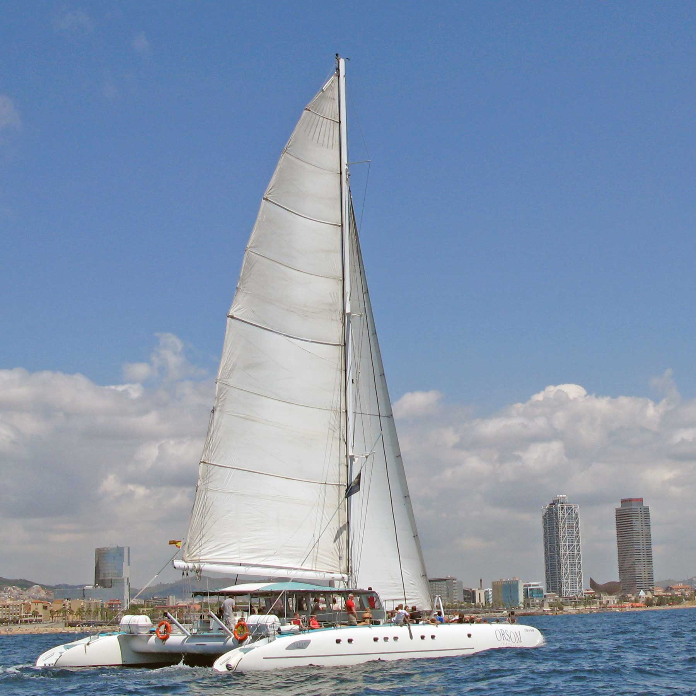
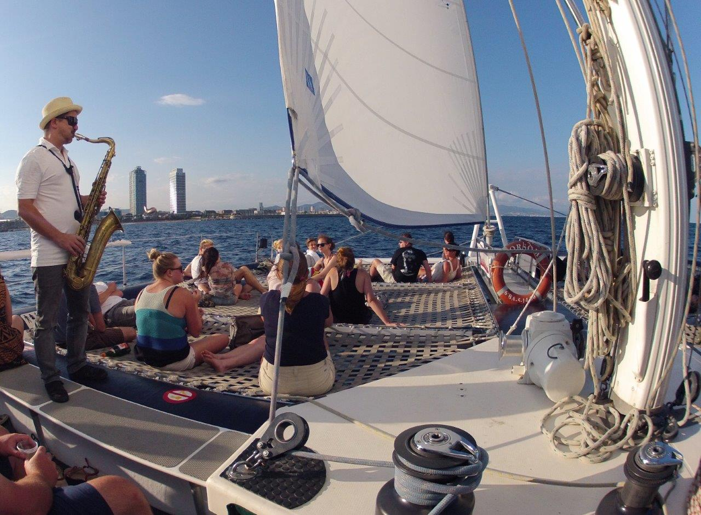
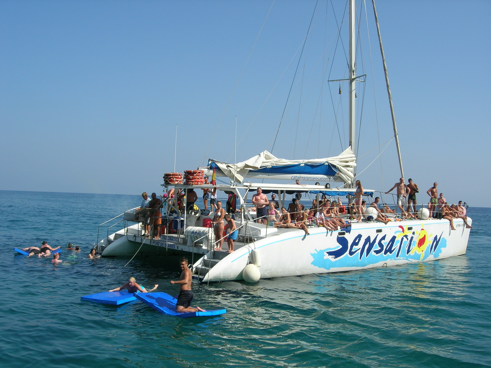

<script> 
    $(document).ready(function() { 
    $head = $('#header'); 
    $head.prepend('<A href = https://www.cuttingedge-events.com></A>') 
    }); 
</script> 


```{r echo=FALSE, message=FALSE,warning=FALSE}
library(readxl)
library(shiny)
library(dplyr)
library(knitr)
```


## Accommodation

### **Main Hotel: Hilton Diagonal Mar**

This hotel is next to Diagonal Mar Shopping Centre and just 400 m from Nova Mar Bella Beach. It offers a seasonal outdoor pool, a fitness centre and air-conditioned rooms with a LED TV.

**Hilton Diagonal Mar Barcelona's** terrace, Purobeach Barcelona, has an outdoor pool and paddling pool available from May to October. All services on the Purobeach terrace, including Balinese beds, sunbeds and massages are available for an extra charge.

The Hilton’s Indigo Restaurant serves international and Catalan food. Purobeach Restaurant offers a diverse menu, as well as a variety of classic cocktails and international spirits. Pistaccio Lounge Bar serves cocktails.


  


### **Alternative Hotels** {.tabset .tabset-fade .tabset-pills}

#### Hotel Arts

Overlooking Barceloneta Beach and Barcelona city centre, this design hotel has 2 outdoor pools and luxury spa with panoramic city views.

The **Arts** is situated next to Barcelona’s Olympic Port and surrounded by shops and lively bars. Barceloneta Beach is 250 m away, while Ciutadella Park is 300 m away.

The **Arts Hotel’s** stylish, spacious rooms include a flat-screen TV and sound system. The bathrooms have a separate bathtub and hydromassage shower.

The hotel’s Enoteca restaurant, awarded 2 Michelin stars, serves fine Mediterranean cuisine, while the creative Arola is run by famous chef Sergi Arola. The property includes a number of other bars and restaurants, including a pool-side bar serving light meals in the summer.

**Hotel Arts** has a hair salon and various luxury fashion boutiques. The hotel also offers a multilingual concierge team and a fully equipped business centre.


<style>
p.comment {
background-color: #ffcc99;
padding: 10px;
border: 1px solid black;
border-radius: 5px;
}
</style>

<p class="comment">
Rates per room and night:
Double room for single use, breakfast included: 475€ VAT inc
Touristic tax: 2,48€ VAT inc per person and night</p>

<p class="comment">This offer is valid for 160 rooms from 28th June to 1st July (the hotel is not available the 27th June)</p>

<p class="comment">This room block is subject to a minimum of 2 f&b event for the 160 pax for a minimum expense of 136,50€ VAT and service inc per person per event.</p>

<p class="comment"> Meeting Room rental HD: 2300€  VAT inc - audiovisual equipment not included</p>


 

 

 


## Programme

### **Programme Overview and timeline**

```{r echo=FALSE, message=FALSE,warning=FALSE}
library(timevis)
library(dplyr)
library(readxl)

timeline <- read_excel("timeline.xlsx", sheet = "Sheet1", 
    col_types = c("date", 
        "text", "text", "numeric", "text", 
        "text"))

data <- data.frame( id = 1:length(timeline$start),
                    start = as.POSIXlt(timeline$start),
                    content = timeline$content,
                    group = timeline$group,
                    type = "box",
                    style = "background-color:#FF9933;")

groups = data.frame(id = 1:4, content = c("Morning", "Lunch", "Afternoon", "Diner"))

tl <- timevis(data, groups, showZoom = TRUE, zoomFactor = 0.2, fit = TRUE, width = '100%', height = 500)

tl %>% setOptions(list(orientation = "top", align = "left"))

```

### **Map**

```{r echo=FALSE, warning=FALSE, message=FALSE}

library(leaflet)
library(stringr)
library(ggmap)
library(readxl)
library(dplyr)
library(leaflet.extras)
library(shiny)

coordinates <- read_excel("timeline.xlsx", 
    sheet = "Sheet3", col_types = c("text", 
        "text", "numeric", "numeric", "text", 
        "text"))

coordinates$Category <- factor(coordinates$Category)

m <- coordinates %>% 
  leaflet(options = leafletOptions(dragging = TRUE,
  minZoom = 11, maxZoom = 50)) %>% 
  addProviderTiles("Esri") %>% 
  setView(lng = 2.1687300, lat = 41.3863900, zoom = 14) 

pal <- colorFactor(palette = c("red","blue"),
      levels = coordinates$Category)

m %>% clearBounds() %>% 
  addCircleMarkers(radius = 5, color = ~pal(Category)) %>% 
  addPopups(popup = paste0("<b>",coordinates$Location,"</b>")) %>% 
  addLegend(position = "bottomright", pal = pal, 
  values = coordinates$Category) %>% addResetMapButton()

```


### **DAY 1 - Thursday 27th June** 

Guest will arrive in Barcelona's Airport and 2 or 3 persons from Cutting Edge Staff will welcome them and walk them to the buses that will transfer them to the hotel.
After a short free time to refresh they will go by bus to the restaurant for dinner

##### **El Xalet de Montjuic**

Located in an idyllic setting on the top of the Montjuïc hill, **El Xalet** is a spectacular restaurant that offers the best views over Barcelona from its dining rooms and wonderful panoramic terraces. Exquisite and modern in its design, the restaurant presents, in a select and refined atmosphere, signature Mediterranean and Catalan cuisine. 

Perfect to welcome our guests the first evening, they will be seated in a private dinning room.

 

 

### **DAY 2 - Friday 28th** 

#### **Meetings at the hotel**

2 hours meeting for 30 persons, the hotel has modern meeting rooms with daylight 

 


#### **Catamaran Activity**

Guests will be transfered to the Olimpic Port where they will go onboard 2 catamarans up to 100 pax each.

Both catamarans will sail together and they will stop one next to the other to offer guests the option to swin and enjoy of the sea.
We propose to do a 4 hours activity having lunch on board - the catering will be the same in both catamarans and it will be served at the same time. 

Optionally we can offer to contract a saxo player, hinflatable toys and other extra activities as jet skis (not for everyone but just to offer guests the option to try)

 

 

 

#### **Dinner at El Principal de l'Eixample**

After some free time at the hotel to refresh, our guests will be transferred to the Eixample Quarter where located 50 meters from the famous La Pedrera and Paseo de Gracia, we can find **El Principal** that  is a versatile space.

It is a stately main floor flooded with natural light thanks to its large windows. It has a magnificent interior courtyard. 

It is the perfect place for our second evening, it is an elegant and very cozy space that will be in exclusive for our guests.

**El Principal** bases its cuisine in the traditional Catalan cuisine and seasonal products, and offer proposals developed especially for groups and special occasions. Also it has an extensive wine list.

 


 


### **DAY 3 - Saturday 29th** 

Just in front the hotel guests will find a big mall called **Diagonal Mar** so, that ones that love to buy will find a lot of options. The beach is also less than 10 minutes walking from the hotel, so, we propose to let guests a free morning to relax and enjoy the hotel and its suroundings.

As an option we propose 2 activities depending on guests preferences. 

#### Morning Optional Activities {.tabset .tabset-fade}

##### Camp Nou and Barça Museu 

Activity for a minimum of 20 pax, they will be transfered to the Camp Nou and they will visit the Stadium and the Museum guided by a interactive audio-guide.  They will visit the pitch, the trophies room, the interactive AV room, etc.
This visit includes a new virtual reality area, in which users can put themselves inside a training session or game at the stadium tahnks to 360 technology. The projection will last for four minutes ans is a unique, innovative experience for Barça Fans. 

 

 

 

##### Sagrada Familia guided visit

Activity for a minimum of 25 pax, our official guide will pick up guests at the hotel and they will be transfered to Sagrada Familia by a private bus. The guide will explain about the history of the city and the Modernist style in their way to the temple. Once they will arrive the will see the outside and the guide will explain them the meaning of the façades.
Then they will go inside and the will enjoy this magnificient temple.

 

 

 

#### **Lunch Restaurant: Can Travi Nou**

After enjoying the morining as they will prefer, guests will go by bus to the restaurant for lunch.
**Can Travi Nou** is a restaurant placed in a Catalan manor house that dates back to the 17th century, the dining rooms and gardens of which make of the place an idyllic setting.

The restaurant’s success is definitely due to its charm. Decorated with exquisite taste, the different dining rooms present a warm, inviting atmosphere, and the wonderful garden invites us, in the summertime, to enjoy a lunch under the sun or a dinner under the moonlight in an impeccable terrace.

The menu offers good traditional Catalan and Mediterranean cuisine.

Our guests will be seated at the covered garden, perfect for them as it is a fresh outdoor space but covered in case of rain and private.

 

 


After lunch guests will enjoy some time at the hotel to refresh and rest.

#### **Gala Dinner at Cordorniu Winery**

After 45 minutes of transfer by bus, guests will arrive to Codorniu Winery. Codorníu is synonymous to the history of a family of winegrowers which goes back to the XVI century. It is the oldest family business in Spain and one of the oldest in the world. It now has 450 years of history behind it. 

 

The Gran Celler and Museum is a modernist building designid but the architect Josep Puig i Cadafalch between 1902 and 1915.
In the magnificient building is where we propose our Gala Dinner.

When guests will arrive they will walk trough the Codorniu family propierty to arrive to the Museum, and outside they will enjoy the welcome cocktail.


 

This cocktail will be around 1 hour, during this time we suggest to give guests the option to do a private visit to the winery on an electric train. This visit has a duration of 25 minutes and each train is up to 30 pax, so we suggest to have 2 trains working like  shuttle during the whole cocktail. The train has a voice over that will explain guests theb history of the place and a little bit of the process how to elaborate cava.

 

During the cocktail while they are ouside the museum we suggest to have some entertainment, we think that the most suitable is to have a DUO of Spanish Guitarists

In case of rain , guests will enjoy the welcome cocktail at the museum (just the upper floor of the main dinning room)

 

After the train visits and the cocktail guests will go down to the main dining room by the central stairs.
They will enjoy a high quality gala menu elaborated onsite with fresh seasonal ingredients.

 

 

After dinner we suggest to enjoy one of the funniest entertaiment where everyone is welcome to sign and dance: Rumba catalana.
There will be 3 guitarists and 3 dancers that will play, sing and dance while they move around the room inviting everyone to join the party.

### **DAY 4 - Sunday 30th June** 

For the last they before the departure, if they have time enough, we recommend to do a Tapas tour. We will split guests in groups of maximum 30 pax and they will have 1 guide per group. They will be transfered to Plaza catalunya with the same buses that they will have to go to the airport. 

Once in plaza Catalunya, every group will start a different route to see the Gothic and the Born quarters. Every group will do 2 tapas stops, in each stop they will eat 4 tapas and 1 drink, so a total of 8 tapas and 2 drinks.

 

 

After the guided city tour they will go find the buses near Colon, and from there they will go to the Airport


END OF THE PROGRAMME

*****
## Budget 

```{r echo=FALSE, message=FALSE,warning=FALSE}

library(readxl)
library(dplyr)
library(knitr)
library(kableExtra)
library(DT)

budget <- read_excel("timeline.xlsx", sheet = "Sheet2", 
    col_types = c("date", "text", "text", 
        "numeric", "text", "numeric", "numeric"))
budget$DATE <- as.Date(budget$DATE)

DT::datatable(budget, extensions = "Buttons",rownames = FALSE, options = list(paging= FALSE,
initComplete = JS("
    function(settings, json) {
      $(this.api().table().header()).css({
        'background-color': '#ee7600 ',
        'color': '#fff'
      });
    }"),
dom ='Bfrtip', buttons = c('copy','print'),                           pageLength = nrow(budget),autoWidth = TRUE)) %>% 
   formatDate('DATE') %>% 
  formatCurrency(6:7,'\U20AC')


```


****

## Terms & Conditions

  *Rates valid for 2019.
  
  *Net rates for Soluzioni Omnia Media SRL 
  
  *Valid for a group of minimum 160 pax from 27th to 30th June, 2019
  
  *Cutting Edge Events management fee including in the detailed rates
  
  *This budget has been quoted without VAT according to the new VAT law, in case there would be ANY CHANGE we will need to recheck and requote it.
  
  *No reservation has been done. Availability upon request.
  
*****

## Company Profile


